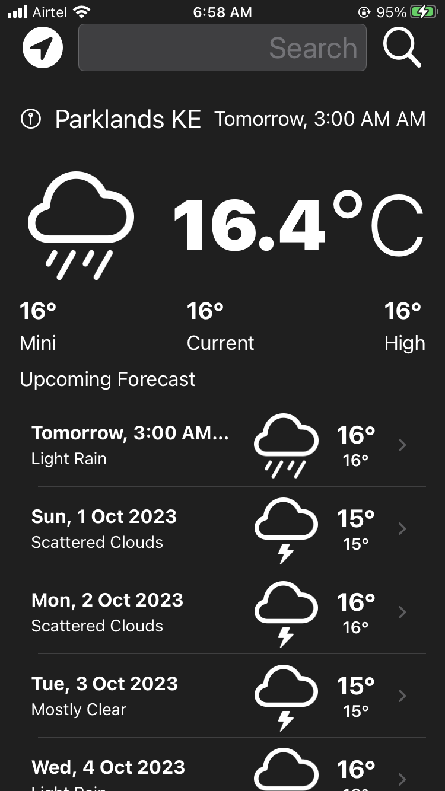
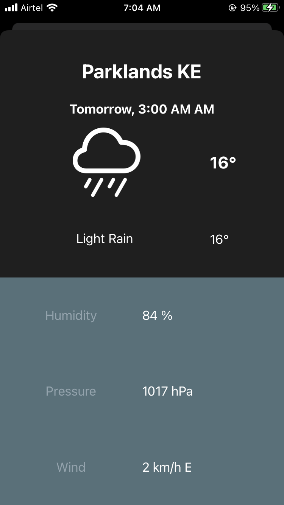
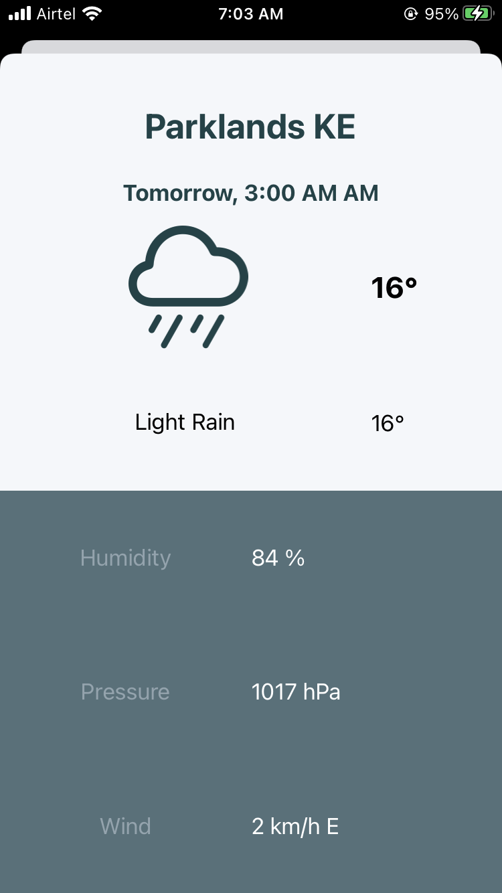

 
#  Check-Weather-Swift

This repository is a weather application to display the current weather ☔  at the user’s location and a
5-day forecast using the  [Open Weather API](https://openweathermap.org/api) built with swift and UIKit


Objective of the Project 
---------------
This challenge is aimed at testing my ability to implement API as The best way to learn coding is by coding 

✨Application Features:
--------------
This app enable users to:
- See the weather details as well as a 5 days forecast of their current location
- Search a location and see the weather details 


# [Screenshots 📱](Screenshots/)

|                            Home       (Dark Theme)                            |                           Home  (Light Theme)                            |
|:-----------------------------------------------------------------------------:|:------------------------------------------------------------------------:|
|  |  |

|                            More Details (Dark Theme)                            |                               (Light Theme)                                |
|:-------------------------------------------------------------------------------:|:--------------------------------------------------------------------------:|
|  |  |


## Tech-stack used 🛠
| **Tech Tools**                                           | **Usage/Purpose** |
|----------------------------------------------------------|-------------------|
| [Swift](https://www.swift.org/)                          | Language          |
| [UIKit](https://developer.apple.com/documentation/uikit) | UI                |

---
## Development Setup ⚙️ and Pre-requisite 📝
**The Project uses OpenWeather API :**
1. [OpenWeather API 🔑](https://openweathermap.org/current) for Weather Data and.


#### _⚙️ Setup Weather Data API_

 <br/>
This project fetches weather data from the [OpenWeather API](https://openweathermap.org/current).  
To begin the setup, you'll need to create an account and get a free API key.
1. Create an account at [openweathermap.org](https://home.openweathermap.org/api_keys)
2. Go to settings from the profile icon
3. Click on API
4. Click on Create

create a Config file  `Config.xcconfig` and place your API config there 

```swift
#Insert at ~/ Config.xcconfig

// Configuration settings file format documentation can be found at:
// https://help.apple.com/xcode/#/dev745c5c974
//
API_KEY = <Your API Key>
````


License
--------

      Check-Weather-Swift
      Copyright (c) 2021 Awesome Jim (https://github.com/AwesomeJim/Check-Weather-Swift).

      Licensed under the Apache License, Version 2.0 (the "License");
      you may not use this file except in compliance with the License.
      You may obtain a copy of the License at

         http://www.apache.org/licenses/LICENSE-2.0

      Unless required by applicable law or agreed to in writing, software
      distributed under the License is distributed on an "AS IS" BASIS,
      WITHOUT WARRANTIES OR CONDITIONS OF ANY KIND, either express or implied.
      See the License for the specific language governing permissions and
      limitations under the License.
